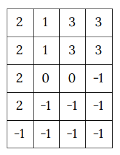

Inventory
=========

Let's solve some variant of the tiling problem:

* given field with specified size
* and some objects (tiles) as rectangles with specified width and length
* find a way to put all such tiles in the field without overlaps.

This is similar to how inventory works in some old-fashioned RPG.

In our model we define field as ``M*N`` matrix `A`, where:

* `A[i, j] == -1` means the cell is empty (contains no tile)
* `A[i, j] == K` - means the cell is occupied by tile with the number of `K`.

We will use ``zn.exists`` function for the model definition, basically we will say that for every object(tile) the
should exist at least one region in the field with the size of the object and its value.

Python Model
------------

.. testcode::

    import zython as zn

    class MyModel(zn.Model):
        def __init__(self, objects, inventory_shape):
            self.objects = zn.Array(objects)
            self.inventory = zn.Array(zn.var(range(-1, self.objects.size(0))), shape=inventory_shape)
            self.constraints = [zn.forall(range(self.objects.size(0)), self.obj_exists())]

        def obj_exists(self):
            inventory = self.inventory
            return lambda obj: zn.exists(range(inventory.size(0) - self.objects[obj, 0] + 1),
                                         lambda i: zn.exists(range(inventory.size(1) - self.objects[obj, 1] + 1),
                                                             lambda j: self.iter_obj(i, j, obj)))

        def iter_obj(self, i, j, obj_idx):
            return zn.forall(range(self.objects[obj_idx, 0]),
                             lambda k1: zn.forall(range(self.objects[obj_idx, 1]),
                                                  lambda k2: self.inventory[i + k1, j + k2] == obj_idx))

    model = MyModel([[1, 2], [2, 1], [4, 1], [2, 2]], (5, 4))
    result = model.solve_satisfy()
    print(result["inventory"])

    model = MyModel([[1, 2], [2, 2], [3, 1]], (3, 3))
    result = model.solve_satisfy()
    print(result["inventory"])

.. testoutput::

    [[2, 1, 3, 3], [2, 1, 3, 3], [2, 0, 0, -1], [2, -1, -1, -1], [-1, -1, -1, -1]]
    [[2, 0, 0], [2, 1, 1], [2, 1, 1]]

.. warning::

    ``zn.exists`` doesn't mean there will be one and only one such tile, it just constrain there will be *at least* one.

Solutions
---------

We run the model for 2 cases: and it returns the following fields:

* (5x4) field with 4 objects:

* (3x3) field with 3 objects:

.. image:: ../../_static/img/inventory2.png
  :width: 225
  :alt: Inventory 2

