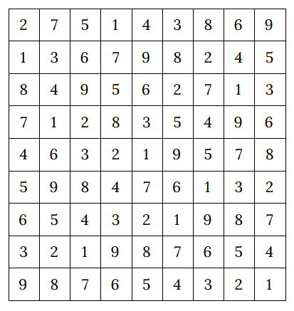

Sudoku
======

`Sudoku <https://en.wikipedia.org/wiki/Sudoku>`_ is a famous logic puzzle. In the most classic version the objective is
to fill 9x9 matrix with 1 to 9 digits with several constraint:

- the should not be any identical digits in any row or columns
- all numbers in every of nine 3x3 submatrix should be different.

Python Model
------------

.. testcode::

    import zython as zn

    class MyModel(zn.Model):
        def __init__(self):
            self.a = zn.Array(zn.var(range(1, 10)), shape=(9, 9))

            self.constraints = [zn.forall(range(9), lambda i: zn.alldifferent(self.a[i, :])),
                                zn.forall(range(9), lambda i: zn.alldifferent(self.a[:, i])),
                                zn.forall(range(3),
                                    lambda i: zn.forall(range(3),
                                        lambda j: zn.alldifferent(self.a[i * 3: i * 3 + 3, j * 3: j * 3 + 3]))),
                                ]

    model = MyModel()
    result = model.solve_satisfy()
    a = result["a"]
    for row in a:
        assert len(set(row)) == 9
    for column in range(9):
        assert len({a[i][column] for i in range(9)}) == 9
    for i in range(3):
        for j in range(3):
            assert len({a[k1][k2] for k1 in range(i * 3, i * 3 + 3) for k2 in range(j * 3, j * 3 + 3)}) == 9
    print("all checks pass")

.. testoutput::

    all checks pass

Generated Field
---------------

The exact field generated by the model can very, depends on solver version, in our case it generated
the following field:

