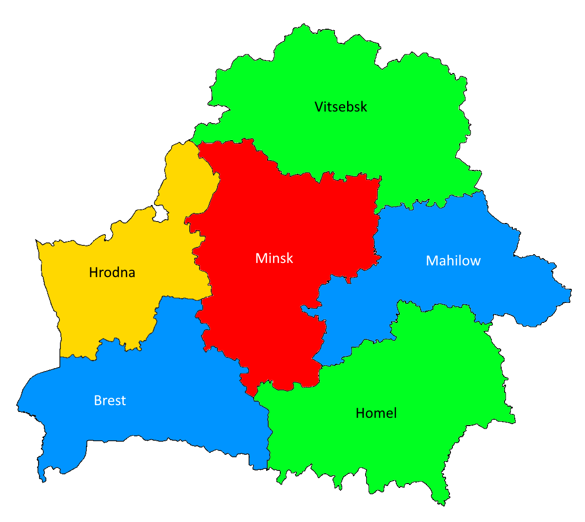

Four color theorem
==================

There is a mathematically proved theorem called `Four color theorem <https://en.wikipedia.org/wiki/Four_color_theorem>`_,
which says that any geographical map can be colored with just 4 colours in the manner every two adjacent regions will
have different colours.

Let find such coloring for `Belarus <https://en.wikipedia.org/wiki/Belarus>`_.

Belarus Map Python Model
------------------------

.. image:: ../../_static/img/guides/getting_started/color_map/Belarus.png
  :width: 600
  :alt: Belarus map

.. testcode::

    import zython as zn

    class MyModel(zn.Model):
        def __init__(self):
            self.hrodna = zn.var(range(4))
            self.brest = zn.var(range(4))
            self.vitsebsk = zn.var(range(4))
            self.minsk = zn.var(range(4))
            self.mahilyow = zn.var(range(4))
            self.homel = zn.var(range(4))

            self.constraints = [self.brest != self.hrodna, self.brest != self.minsk, self.brest != self.homel,
                                self.hrodna != self.minsk, self.hrodna != self.vitsebsk,
                                self.vitsebsk != self.minsk, self.vitsebsk != self.mahilyow,
                                self.minsk != self.mahilyow, self.minsk != self.homel,
                                self.mahilyow != self.homel]

    model = MyModel()
    result = model.solve_satisfy()
    print(result)

.. testoutput::

    Solution(hrodna=3, brest=2, vitsebsk=1, minsk=0, mahilyow=2, homel=1)

Solution
--------

So we can paint map of Belarus, e.g. in the following way (red is 0, green is 1, blue is 2, yellow is 3):

But in some cases just 3 colours are enough. Let's look at two example and try to find such coloring on the map of
`Australia <https://en.wikipedia.org/wiki/Australia>`_.

.. image:: ../../_static/img/guides/getting_started/color_map/Australia.svg
  :width: 600
  :alt: Australia map

Australia Map Python Model
--------------------------

.. testcode::

    import zython as zn

    class MyModel(zn.Model):
        def __init__(self):
            self.nt = zn.var(range(3))
            self.wa = zn.var(range(3))
            self.sa = zn.var(range(3))
            self.q = zn.var(range(3))
            self.nsw = zn.var(range(3))
            self.v = zn.var(range(3))
            self.t = zn.var(range(3))

            self.constraints = [self.wa != self.nt, self.wa != self.sa,
                                self.nt != self.sa, self.nt != self.q,
                                self.sa != self.q, self.sa != self.nsw, self.sa != self.v,
                                self.q != self.nsw,
                                self.nsw != self.v]

    model = MyModel()
    result = model.solve_satisfy()
    print(result)

.. testoutput::

    Solution(nt=1, wa=2, sa=0, q=2, nsw=1, v=2, t=0)
