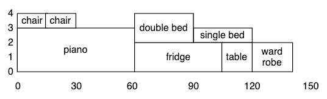
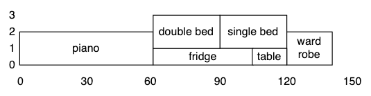

Cumulative
==========

The cumulative constraint is used for describing cumulative resource usage.

It requires that a set of tasks given by start times,
durations, and resource requirements, never require more than
a global resource limit at any one time.

.. note::

    It is suggested to use ranges and sequences of ranges instead of int,
    because minizinc can return strange result when type of any arg is int

Moving Furniture Model
----------------------

We will recreate the example of the moving furniture model from
`minizinc <https://www.minizinc.org/doc-2.7.2/en/predicates.html#cumulative>`_
documentation.

The model finds a schedule for moving furniture so that each piece of
furniture has enough handlers (people) and enough trolleys available during
the move. The available time, handlers and trolleys are given, and the data
gives for each object the move duration, the number of handlers and the
number of trolleys required.

Python Model
------------

.. testcode::

    import enum
    import zython as zn

    class Objects(enum.Enum):
        piano = enum.auto()
        fridge = enum.auto()
        double_bed = enum.auto()
        single_bed = enum.auto()
        wardrobe = enum.auto()
        chair1 = enum.auto()
        chair2 = enum.auto()
        table = enum.auto()

    class MyModel(zn.Model):
        def __init__(self, objects, duration, handlers, trolleys, available_handlers, available_trolleys, available_time):
            # we create zn.Array for duration to use operations with zython variable as indexes
            self.duration = zn.Array(duration)
            self.start = zn.Array(zn.var(range(0, available_time)), len(objects))
            self.end = zn.var(range(0, available_time))
            self.constraints = [
                zn.cumulative(self.start, self.duration, handlers, available_handlers),
                zn.cumulative(self.start, self.duration, trolleys, available_trolleys),
                zn.forall(objects, lambda obj: self.start[obj - 1] + self.duration[obj - 1] <= self.end),
            ]

    model = MyModel(
        Objects,
        duration=[60, 45, 30, 30, 20, 15, 15, 15],
        handlers=[3, 2, 2, 1, 2, 1, 1, 2],
        trolleys=[2, 1, 2, 2, 2, 0, 0, 1],
        available_handlers=4,
        available_trolleys=3,
        available_time=180,
    )
    result = model.solve_minimize(model.end)
    print(result["start"])
    print(result["end"])

.. testoutput::

    [0, 60, 90, 60, 120, 15, 0, 105]
    140

Solutions
---------

Below you can find histograms of handlers and trolleys usages.
© Copyright 2016, 2017, 2018, 2019, 2020 Peter J. Stuckey, Kim Marriott, Guido Tack.

* Handlers Usage:

* Trolleys Usage:

